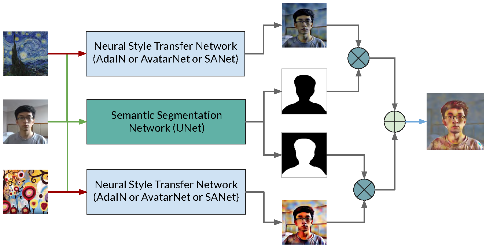

# Semantic Recognized Real-time Camera Style Transfer

## Introduction
This repository is an extension of Image Recognition course final project, which intends to develop an application that can achieve semantic recognized real-time camera arbitrary multi-style transfer. Specifically, we intend to apply different styles to human and background dynamically by utilizing human segmentation technique.   

## Reference Repositories
### Human Segmentation
The human segmentation implementation used in this application is borrowed from this repository: [thuyngch/Human-Segmentation-PyTorch](https://github.com/thuyngch/Human-Segmentation-PyTorch#benchmark). Speciafically, we adopt ResNet18 backboned UNet to do the segmentation.

### Real-time Arbitrary Style Transfer
Three real-time arbitrary style transfer implementations are borrowed from: 
  1. [naoto0804/pytorch-AdaIN](https://github.com/naoto0804/pytorch-AdaIN)
  2. [tyui592/Avatar-Net_Pytorch](https://github.com/tyui592/Avatar-Net_Pytorch)
  3. [GlebBrykin/SANET](https://github.com/GlebBrykin/SANET)

## Application Architecture


## Usage
### Download network weights and install timm for segmentation
Pre-trained weights of all style transfer networks are already included in the repository, while the weights of segmentation network is too large, so download it at [here](https://drive.google.com/file/d/14QxasSCcL_ij7NHR7Fshx5fi5Sc9MleD/view) and place it under ``model_checkpoints`` directory in AdaIN_DynamicMask, AvatarNet_DynamicMask and SANet_DynamicMask. 

Then install timm for segmentation network in any of three subdirectories, e.g.
```bash
cd AdaIN_DynamicMask
pip install -e models/pytorch-image-models
```

### Start web camera application
For AdaIN_DynamicMask and AvatarNet_DynamicMask, use
```bash
python webcam.py --human_style "path to style image for human" --background_style "path to style image for background" --ratio "number between 0 and 1" (optional)
```
The ratio argument is used to adjust the strength of style, 0 means output with be the same as original image, 1 means the strongest style effect.

For SANet_DynamicMask, the borrow implementation currently doesn't support style strength adjustment, so the ratio arguemnt doesn't have any effect. We intend to add this adjustment feature in the future.

## Results and evaluation
### AdaIN

### AvatarNet

### SANet

### Runtime Profile
