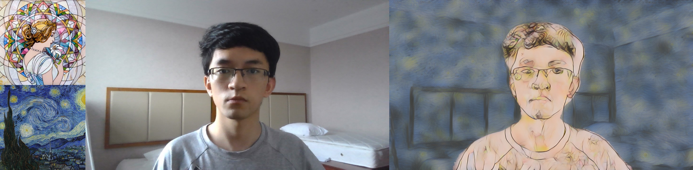

# Semantic Recognized Real-time Camera Style Transfer

## Introduction
This repository is an extension of Image Recognition course final project, which intends to develop an application that can achieve semantic recognized real-time camera arbitrary multi-style transfer. Specifically, I intend to apply different styles to human and background dynamically by utilizing human segmentation technique.   

## Reference Repositories
### Human Segmentation
The human segmentation implementation used in this application is borrowed from this repository: [thuyngch/Human-Segmentation-PyTorch](https://github.com/thuyngch/Human-Segmentation-PyTorch#benchmark). Speciafically, I adopt ResNet18 backboned UNet to do the segmentation.

### Real-time Arbitrary Style Transfer
Three real-time arbitrary style transfer implementations are borrowed from: 
  1. [naoto0804/pytorch-AdaIN](https://github.com/naoto0804/pytorch-AdaIN)
  2. [tyui592/Avatar-Net_Pytorch](https://github.com/tyui592/Avatar-Net_Pytorch)
  3. [GlebBrykin/SANET](https://github.com/GlebBrykin/SANET)

## Application Architecture


## Usage
### Download network weights and install timm for segmentation
Pre-trained weights of all style transfer networks are already included in the repository, while the weights of segmentation network is too large, so download it at [here](https://drive.google.com/file/d/14QxasSCcL_ij7NHR7Fshx5fi5Sc9MleD/view) and place it under ``model_checkpoints`` directory in AdaIN_DynamicMask, AvatarNet_DynamicMask and SANet_DynamicMask. 

Then install timm for segmentation network in any of three subdirectories, e.g.
```bash
cd AdaIN_DynamicMask
pip install -e models/pytorch-image-models
```

### Start web camera application
For AdaIN_DynamicMask and AvatarNet_DynamicMask, use
```bash
python webcam.py --human_style "path to style image for human" --background_style "path to style image for background" --ratio "number between 0 and 1" (optional)
```
The ratio argument is used to adjust the strength of style, 0 means output with be the same as original image, 1 means the strongest style effect.

For SANet_DynamicMask, the borrow implementation currently doesn't support style strength adjustment, so the ratio arguemnt doesn't have any effect. I intend to add this adjustment feature in the future.

## Results and evaluation
### AdaIN


### AvatarNet


### SANet


### Runtime Profile


Runtime profile is tested on server with GTX 1080Ti card by reading one content image repeatedly (Because I can't use camera on server :( , while my laptop doesn't have powerful GPU). The content image size is 1280*720, the style image size is 400*400.

Gatys et al. stands for the first neural style transfer [approach](https://github.com/leongatys/PytorchNeuralStyleTransfer) proposed by Gatys et al. 

The implementation of AvatarNet seems have some efficiency problem, which indicates by its low GPU utilization.

## Reference Paper
1. [L. A. Gatys, A. S. Ecker, and M. Bethge, “Image style transfer using convolutional neural networks,” in Proceedings of the IEEE conference on computer vision and pattern recognition, pp. 2414–2423, 2016.](https://www.cv-foundation.org/openaccess/content_cvpr_2016/papers/Gatys_Image_Style_Transfer_CVPR_2016_paper.pdf)

2. [X. Huang and S. Belongie, “Arbitrary style transfer in real-time with adaptive instance normalization,” in Proceedings of the IEEE International Conference on Computer Vision, pp. 1501–1510, 2017.](https://arxiv.org/pdf/1703.06868.pdf)

3. [Lu Sheng, Ziyi Lin, Jing Shao and Xiaogang Wang, “Avatar-Net: Multi-scale Zero-shot Style Transfer by Feature Decoration”, in IEEE Conference on Computer Vision and Pattern Recognition (CVPR), 2018.](https://arxiv.org/pdf/1805.03857.pdf)

4. [D. Y. Park and K. H. Lee, “Arbitrary style transfer with style-attentional networks,” in Proceedings of the IEEE Conference on Computer Vision and Pattern Recognition, pp. 5880–5888, 2019.](http://openaccess.thecvf.com/content_CVPR_2019/papers/Park_Arbitrary_Style_Transfer_With_Style-Attentional_Networks_CVPR_2019_paper.pdf)